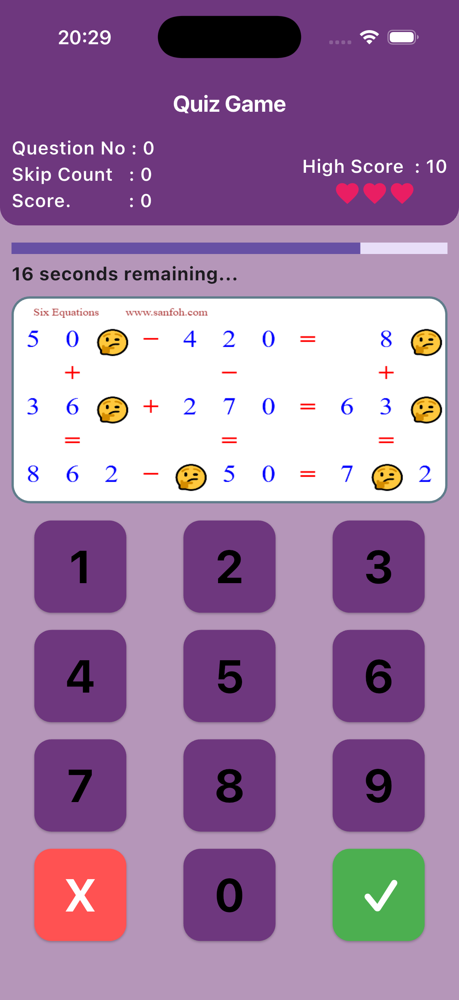
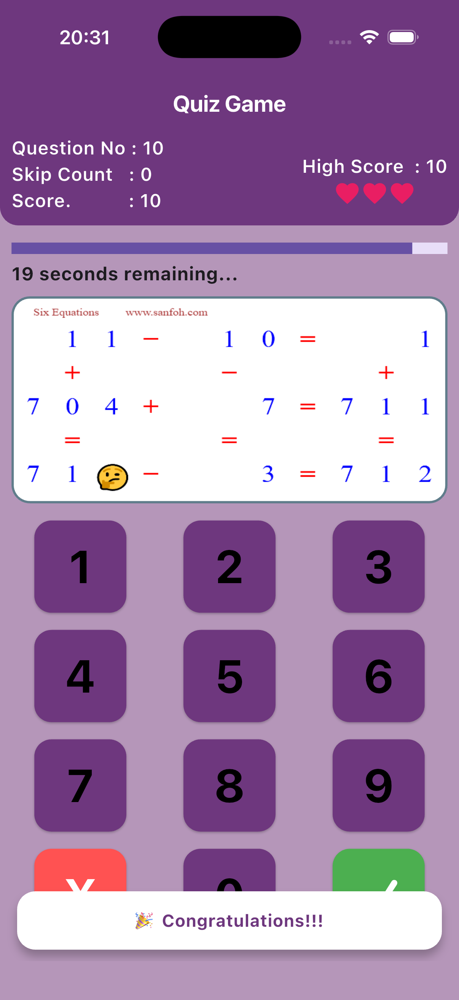
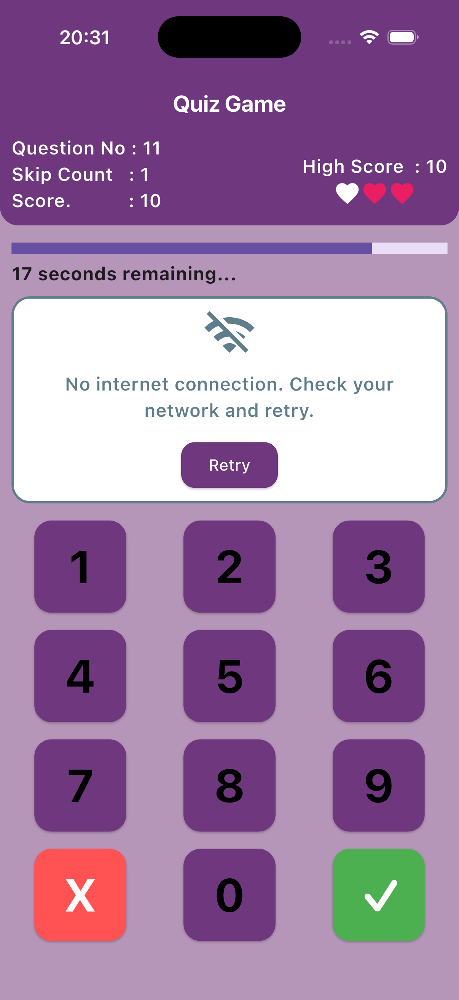

## Fidenz Assignment – Quiz App

A lightweight, fast quiz game built with Flutter. Players are shown an image-based question and must select the correct number (0–9) within 20 seconds. The app tracks score, fails (lives), skips on timeout, and persists the high score locally.

### Key Features

- **Image-based questions** fetched from a configurable API
- **Numeric keypad** with clear (X) and submit (✓)
- **Dual timers**: a linear progress bar and a textual countdown
- **Game rules**: 3 fails end the game; timeouts count as skips and fails
- **High score** persisted via `shared_preferences`
- **Robust error handling** for network issues and server responses

### App Screenshots
<table>
  <!-- Row 1 -->
  <tr>
    <td></td>
    <td></td>  
  </tr>
  <!-- Row 2 -->
  <tr>
    <td></td>
    <td></td>
  </tr>
</table>

## Getting Started

### Prerequisites

- Flutter SDK (3.9+ recommended)
- Dart SDK (comes with Flutter)
- Xcode (for iOS) / Android Studio (for Android)

### Install Dependencies

```bash
flutter pub get
```

### Environment Variables

Create a `.env` file at the project root (already whitelisted in `pubspec.yaml`).

```
# Base URL for the questions API (no trailing path; app calls GET "")
API_BASE_URL=https://your-api.example.com
```

The API should return a JSON body matching:

```json
{
  "question": "https://domain.com/path/to/image.png",
  "solution": 7
}
```

### Run

```bash
flutter run
```

### Build

- Android: `flutter build apk`
- iOS: `flutter build ios`
- Web: `flutter build web`

## App Functionality

- On launch, the app loads env vars, shows `HomePage`, and fetches the first question.
- Each round:
  - A 20s timer starts (text countdown + linear progress bar).
  - Select a number on the keypad, then tap ✓ to submit.
  - Correct: score++, question++, timers restart, next question loads.
  - Incorrect: fails++, question++, timers restart, next question loads.
  - Timeout: counts as fail and skip; question++, timers restart.
  - Every +10 score triggers a brief congratulations snackbar.
- High score is updated when current score exceeds stored high score.
- After 3 fails, the game ends with a final score and a “start again” button.

## Code Structure

```
lib/
  main.dart                   # App entry; loads .env and runs MainApp
  app.dart                    # Minimal MaterialApp → HomePage
  components/
    my_button.dart            # Reusable keypad button
  features/
    home_page.dart            # Game UI, timers, state, and interactions
  data/
    repositories/
      quection_repository.dart   # Fetches questions via API service
      score_repository.dart      # High score read/write orchestration
    services/
      quection_api_service.dart  # Dio client, error mapping, JSON parsing
      local_storage_service.dart # shared_preferences wrapper
  models/
    quection_model.dart       # { question: String(url), solution: int }
```

### Notable Modules

- `HomePage`
  - Manages game state: `score`, `fails`, `skipCount`, `quizcount`, `solution`, and keypad selection
  - timers using `linear_timer` and `timer_count_down`
  - Handles success/fail/timeout flows and restarts timers appropriately
  - Displays network, image, and empty states with helpful messaging and a retry
- `QuectionApiService`
  - Configured with `Dio` and `API_BASE_URL` from `.env`
  - Maps `DioException` cases to user-friendly messages
  - Parses the API response into `QuectionModel`
- `ScoreRepository` + `LocalStorageService`
  - Stores and retrieves high score via `shared_preferences`

## Configuration & Environment

- Env is loaded at startup (see `lib/main.dart`):
  - Uses `flutter_dotenv` to read `.env`
  - `QuectionApiService` reads `API_BASE_URL`
- Ensure `.env` exists and contains a valid `API_BASE_URL`.

## Error Handling

- Network and API errors surfaced in the UI with retry:
  - Timeouts → “Request timed out. Please try again.”
  - No connection → “No internet connection. Check your network and retry.”
  - 5xx → “Server is unavailable. Please try again later.”
  - 404 → “Content not found (404). Please try again later.”
  - Unknown → “Unexpected error occurred. Please try again.”

## Development Notes

- UI colors and spacing are centralized in `HomePage` for simplicity.
- The keypad is driven by a list of button configs; `MyButton` handles visual state.
- The app intentionally restarts both timers on every state transition to keep rounds consistent.

## Testing the API Locally

If you mock an API, ensure it returns the exact JSON fields:

```json
{ "question": "https://.../image.png", "solution": 3 }
```

For development convenience, you can serve a static JSON via a local server and set `API_BASE_URL` to that origin (CORS required for web).

## Troubleshooting

- Blank image / broken image icon:
  - Verify `question` is a valid, publicly reachable image URL
  - Check CORS when running on web
- “Unexpected response from server”:
  - Ensure the endpoint returns the JSON schema shown above
- No internet / timeouts:
  - Confirm device connectivity and try again
- High score not persisting:
  - Ensure the app isn’t running in an ephemeral context (e.g., web incognito)

## Tech Stack

- Flutter, Dart
- `dio`, `flutter_dotenv`, `linear_timer`, `timer_count_down`, `shared_preferences`

## License

This project is for assignment/demo purposes. Add a license here if needed.
